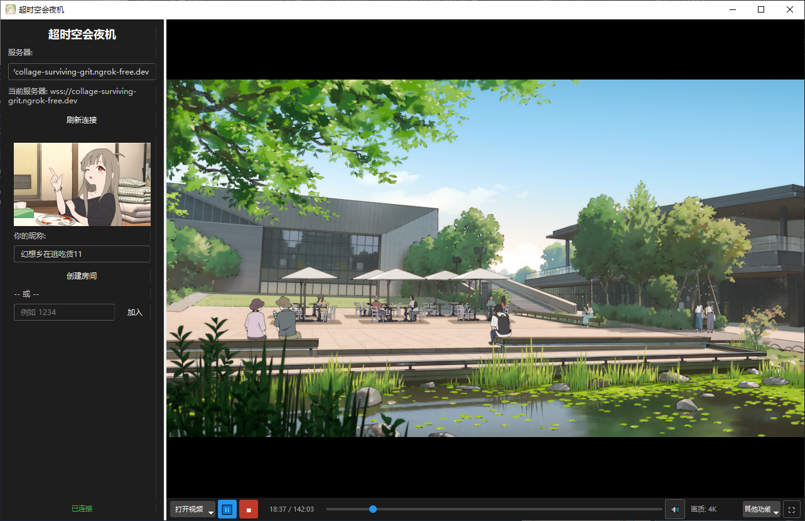
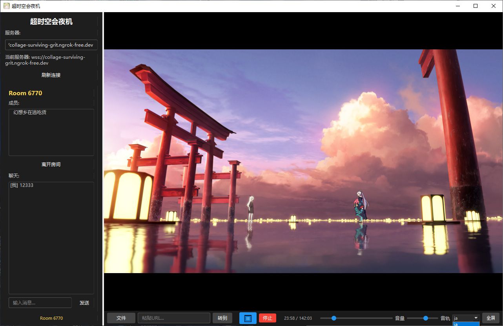

# 超时空会夜机

> 基于内网穿透的异地同步观影软件


---

## 简介

超时空会夜机 是一款支持**异地同步观影**的桌面应用。朋友间各自在电脑上打开客户端，进入同一个房间，播放进度就会实时同步————————你暂停他也暂停，你拖进度条他也跟着跳转，就像坐在一起看一样。

---

## 功能特性

| 功能 | 说明 |
|------|------|
| 房间同步 | 创建/加入房间，播放进度实时同步 |
| 播放控制 | 播放、暂停、拖进度、音量调节，全员同步 |
| 弹幕聊天 | 边看边聊，弹幕飘过屏幕 |
| 内网穿透 | ngrok，也可使用其他工具 |
| 多客户端 | 不限人数，免费加入 |

---

## 快速开始

注：已上传服务端以及客户端的打包文件，仅需其中一人根据说明配置ngrok和启动服务器即可

### 环境要求

- Python 3.10+
- [ngrok](https://ngrok.com/)（服务端需要）

### 安装依赖

``bash
pip install PySide6 python-mpv websockets
`

### 启动服务端

`powershell
python server.py
`
同时打开自己的ngrok或其他内网穿透工具并获取ip地址


### 配置客户端

打开 config.json，填入服务器地址：

`json
{
  "server": "wss://xxx.ngrok-free.dev",
  "nickname": "你的昵称"
}
`
或者启动客户端之后在客户端界面中填写

### 启动客户端

`powershell
python client.py
`
---

## 项目结构

```
WatchingTogether/
├── server.py               # WebSocket 服务端，管理房间和同步状态
├── client.py               # 客户端入口
├── config.json             # 客户端配置文件
│
├── app/                    # 客户端核心模块
│   ├── player.py           # mpv 播放器封装
│   ├── network.py          # WebSocket 网络通信层
│   ├── config.py           # 配置管理
│   │
│   └── ui/                 # Qt 界面组件
│       ├── main_window.py  # 主窗口
│       ├── controls.py     # 播放控制栏
│       ├── room_panel.py   # 房间面板
│       └── danmaku.py      # 弹幕组件
│
├── libmpv/                 # mpv 运行时依赖
├── mpv_config/             # mpv 播放器配置
└── assets/                 # 资源文件
```

---


## 界面预览

### 首页


### 加入房间



## 技术栈

| 技术 | 用途 |
|------|------|
| Python + asyncio | 异步服务端与客户端 |
| websockets | 实时双向通信 |
| mpv + python-mpv | 高性能视频播放 |
| PySide6 | Qt 桌面 UI |
| ngrok | 内网穿透 |

---

## 作者

[@hxxztch](https://github.com/hxxztch)
